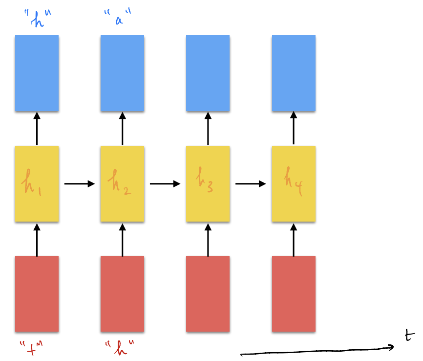
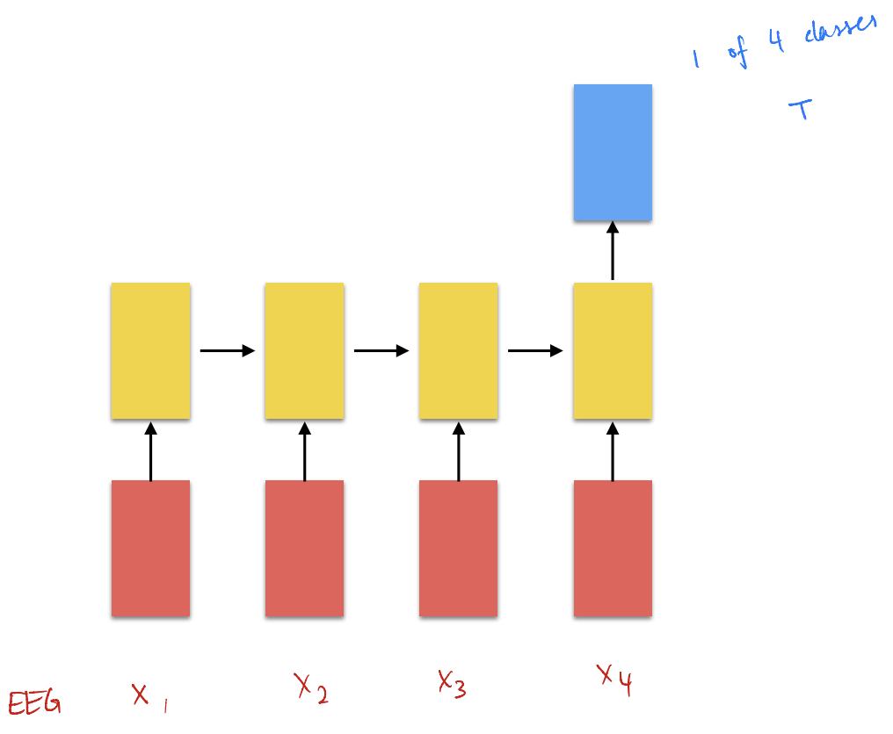
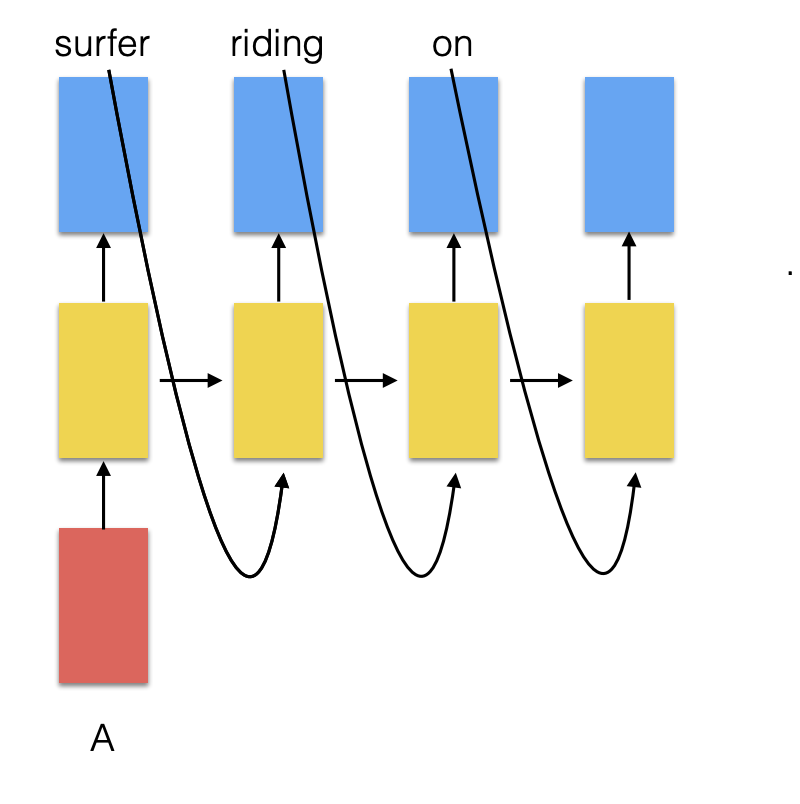
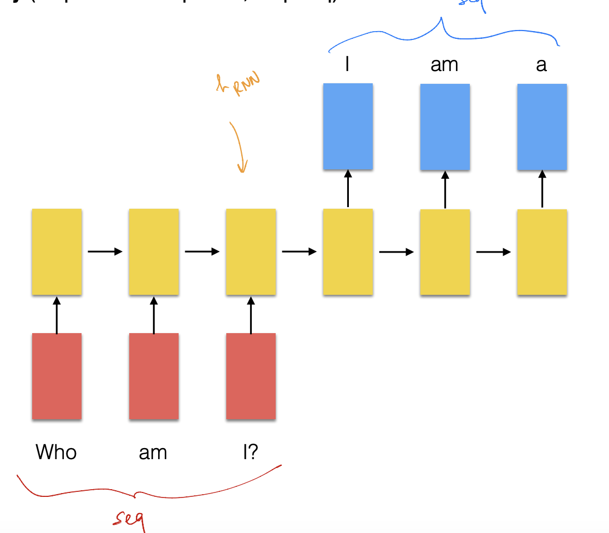
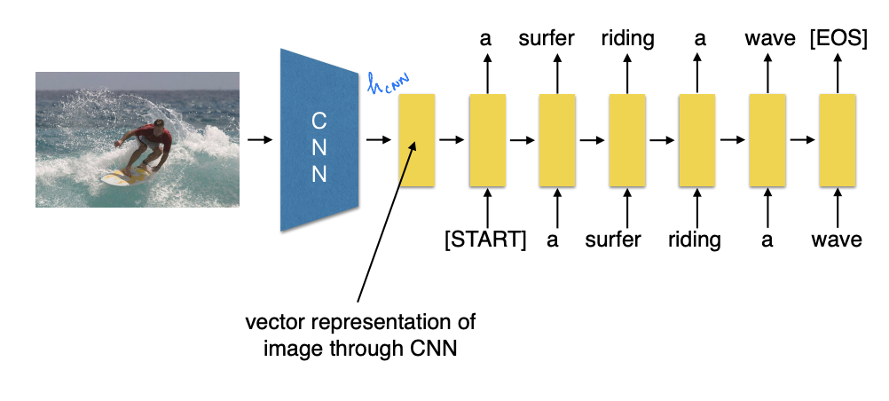
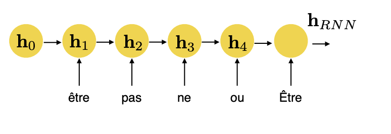
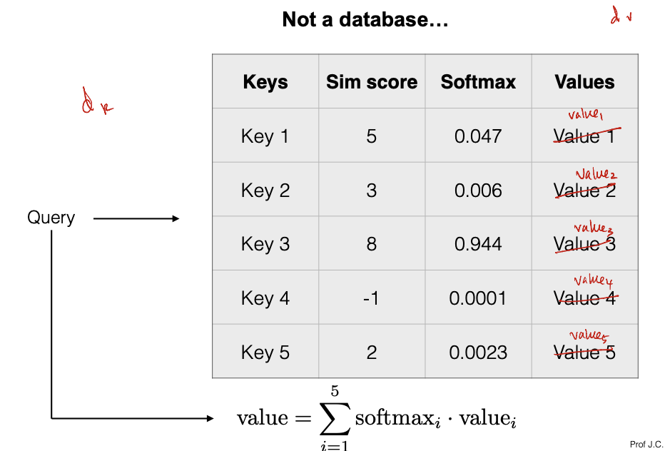
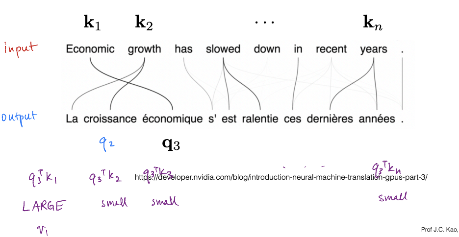
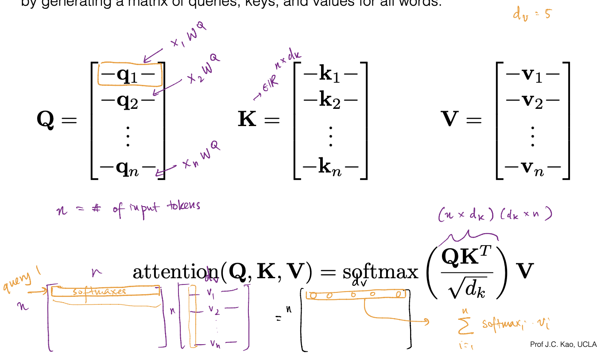

# Sequence to Sequence
- Recurrent Neural Networks (RNN) could represent a *history* of inputs via their *hidden states*
- RNN's are an example of a *many-to-many* mapping, where every input produces an output, and there are *multiple inputs and outputs*
  - 
    - The yellow boxes represent hidden states
  - Examples of many-to-many mappings include video annotation, where each *frame* of a video is associated with a label (there are many frames, and each frame has an associated output)
- There may also be *many-to-one* mappings, where multiple inputs ultimately lead to a *single output*
  - 
  - One example of this is classifying an EEG dataset
- There may also be *one-to-many* mappings, where a single input ultimately leads to *multiple outputs*
  - 
  - Text generation is an example of a one-to-many mapping
- Machine translation is another example of a *many-to-many* mapping; to be more precise, they are *sequence to sequence models*, since they take a sequence of text at the input and output a sequence of text
  - 
  - With RNN's, the goal is to take an input sentence and hopefully capture enough *context* to translate the sentence into another language properly
- Representing words:
  - Words can be conceptualized as a *one-hot representation* of the entire dictionary (e.g. first dimension is "aardvark" and last dimension is "zyzzyva")
  - In actuality, "tokens" are used, and they are generated via the **byte pair encoding (BPE)** algorithm
    -     Initialization:
            Put all unique characters in text into vocabulary V
            Tokenzie text into separate characters
          for loop (K times, K is a hyperparameter):
            Find most frequent adjacent pair of tokens
            Merge this pair of tokens
            Add the merged pair to the vocabulary V
            Re-tokenize based on the new V
    - There are explicit tokens for the *start* and *end* of generation
    - One approach to generate text, an initial token can be started, generating a new token, and then this token can be used to feed the input (to generate the next token, and so forth)
- A recurrent neural network can be conditioned (e.g. like on an image: input image -> "a surfer riding a wave") by passing in the input to a different neural network (e.g. a CNN) that is then vectorized into the *starting state for the recurrent neural network*
  - 
    - The CNN acts like an *encoder* and the RNN acts like a *decoder*
  - This can also be applied for *machine translation*, where there is an *RNN encoder* that produces a *context vector* and a *RNN decoder* that translates
    - Some issues using recurrent neural networks is that since there is a *single context vector*, there may not be sufficient capacity and so prior words may be "forgotten" in favor of recent words (which is not good)
      - One way to mitigate this is to *reverse* the input sentence
      - LSTM (RNNs) may also be *stacked* (typically 2-4)
- One key insight to motivate attention is that, during the encoding of an RNN, there is a hidden state corresponding to *every word*, but only the last hidden state is actually considered
  - Instead of just considering the last hidden state, it may be beneficial to consider *all hidden states*
  - Doing this naively, though, would lead to many parameters - it would instaed be better to pass in inputs that the RNN, at a time step, should *pay attention to*
  - 
# Attention
- Queries, Keys, and Values:
  - In a traditional dictionary, a query yields a *single* value - this is **hard attention**
  - In deep learning, we want **soft attention**, where a query can yield *multiple* values - done using a similarity score over multiple keys
    - 
    - The similarity score is condensed into probabilities via a softmax, and the actual *value* returned by a query is the weighted sum (weighted from the softmax) over the values
  - The queries, keys, and values come from *separate* linear transformations - the *ith* word produces the *ith* query, *ith* value, and *ith* key
    - The *ith* input token is M-dimensional, the queries and keys are K-dimensional, and the values are V-dimensional
    - A query is computed as $q_i = (W^Q)x_i$, where $W^Q \in R^{K \times M}$
    - A key is computed as $k_i = (W^K)x_i$ where $W^K \in R^{K \times M}$
    - A value is computed as $v_i = (W^V)x_i$ where $W^V \in R^{V \times M}$
  - Similarity score is measured via a *dot product* and is normalized by the dimensions of the keys and queries (to normalize the variance of the dot product): $\frac{q^T k_i}{\sqrt{d_k}}$
  - 
    - This is an example of *cross-attention*, where attention is between the input and output; in *self-attention*, attention is performed within an input itself (e.g. attend to previous words in a sentence)
  - The softmax and weighting can be done *all at once* using a matrix of queries, keys, and values for all words:
    - attention(Q, K, V) = softmax($\frac{QK^T}{\sqrt{d_k}}$)$V$
    - 
- **Multi-aheaded attention** involves several, *parallel* attention layers
  - This can allow for *multiple* aspects (e.g. words) to be attended to, since softmax typically focuses on a single key/value pair
  - To get the output over all of these attention aheads, we can simply do: $O = ZW^O$, where Z contains all attention head ouputs and W is a learnable weight matrix
# Transformers