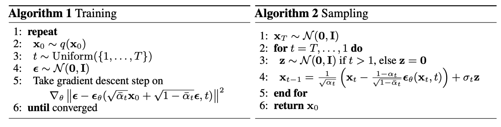
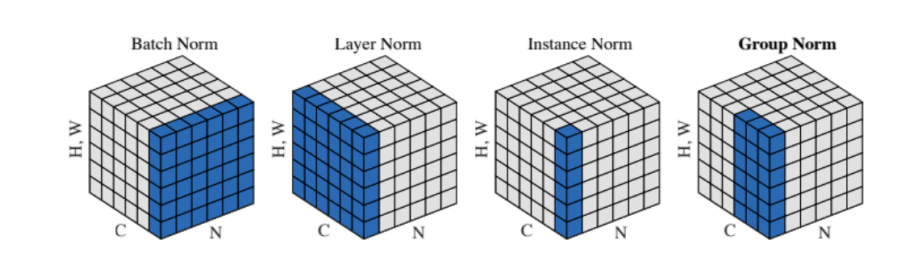
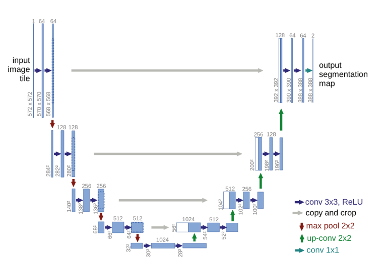
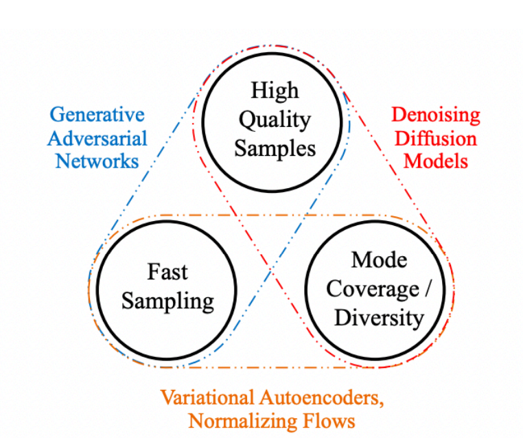

# Diffusion
- The intuition behind a diffusion model is to simulate a forward process - turning an image into Gaussian noise (in an intentional way) - and then learning the *backwards process* (going from Gaussian noise to an image)
- 
    - Training:
        - $x_0$ is the image to be generated, sampled from the underlying distribution
        - Some time along the forward diffusion process is sampled ($t$)
        - Noise is sampled $\epsilon$
        - A neural network $\epsilon_{\theta}$ takes in a noisy image ($\alpha_t$ is a scalar that starts at 1 and goes to zero as time passes)
        - The point here is to gradually transform the image into noise using a forward process with parameters learned by the neural network with mean $\sqrt{\bar{\alpha_t}}$ and variance $\sqrt{1 - \bar{\alpha_t}}$
            - This forward process is dependent on time steps, and so there are different means and variances depending on time
            - In practice, when training, these time steps are randomly sampled (so that the batch eventually captures them all)
    - Sampling:
        - Start off with fully Gaussian noise and subtract off the noise ($t = T$ to $t = 0$)
        - During training, the network has learned the noise to *add* to a starting image to get it to unit Gaussian, so doing the *reverse* in this case acts to generate
        - The $\sigma_t z$ term is necessary because the *reverse process* has a covariance of $\sigma_t$ (and this is typically set to $\sqrt{\beta_t}$)
            - Additionally, adding noise allows for more varying sampled images because without the noise term the sampling process is *deterministic*
## Diffusion in Practice
- Prevailing architectures for diffusion models are *U-Nets*
    - In general, these architectures are good when the inputs and outputs are the same size
        - These architectures make the features *smaller* (compressed features) and then *larger*
        - These architectures contain skip connections (residuals), which help with backpropagation    
    - The residual blocks in the U-Net contain:
        - Group normalization followed by a convolutional layer
            - 
            - For small batch sizes ($N$), layer / group norm is preferred over batch norm because the samples may be too disparate to provide proper statistics
            - Group norm may be preferred over layer norm because the different channels may have their own features and thus it would be better to capture multiple statistics rather than a single statistic over all channels (which layer norm does)
        - A time embedding
        - Another group normalization followed by a convolutional layer
        - A shortcut (skip) path
    - U-Nets may also have attention blocks
        - These are useful for queries of what to generate (e.g. `White dog sitting on grass`)
    - U-Nets also have down-blocks (Residual Blocks and Attention Blocks) and up-blocks (also Residual Blocks and Attention Blocks on the combined blocks)
    - U-Nets typically use the `Swish` activation function: $x \cdot \sigma(x)$
    - 
- Some implementations of *conditional* diffusion networks pass the condition class into an encoder network to generate an embedding that can be added, multiplied, concatenated, etc. with the input image 
    - This introduces the class into the input itself so that the model can learn it
## Issues with Diffusion Models
- 
- **Denoising Diffusion Implicit Models (DDIM)** try to *skip* steps in the *for loop* while still maintaining the same quality
    - If this is done, the process is no longer Markovian
    - They make the process rely also on $x_0$ so that $x_t$ can be inferred from $x_0$
        - The derivations for this are still possible, and can allow for some steps to be "skipped" in the loop