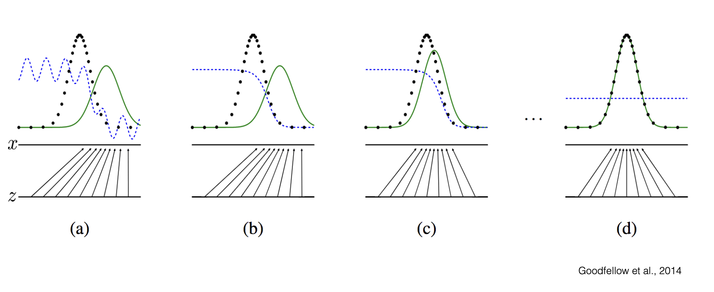

- **Generative modeling** involves drawing samples from some distribution target $p(x)$
  - This distribution may be exceedingly complex - think of the distribution of natural images (e.g. 256 by 256 by 3)
# Generative Adversarial Networks (GAN)
- One approach to generative modeling is with a **Generative Adversarial Network**, which attempts to draw samples by using another network such that the network correctly classifies the generated sample based on that generator
  - The GAN does not have a closed-form solution for the distribution $p(x)$ but rather takes samples from the implicitly learned distribution
- Using GANs allows for samples to be generated on the data manifold as opposed to using a mean-square error approach, which will not necessarily generate samples lying *on* the manifold, given that it attempts to take an average
  - 
- GANs can generate relatively high-dimensional images from low-dimensional noise
  - One application of this is to interpolate between images by varying the noise between the two images
- The **generator network** generates the samples that try to *look like the training set*, where as the **discriminator network** observes both real and fake samples and decides if they are real or fake
  - The output of the discriminator a sigmoid probability (from 0 to 1), where 0 corresponds more strongly to a fake classification (generated) whereas 1 corresponds more strongly to a real classification (from the actual training set)
  - The input to the generator network is noise, which it then transforms into a fake image
    - Neural networks are powerful enough to shape random noise into actual images
    - Gaussian Noise is typically used since it has zero mean (no prior)
    - The latent space associated with the noise, once the generator network is trained, may have different interpretable meanings (e.g. one portion of the space may be associated with dogs, another portion associated with cats, etc.)
  - 
## Intuition
- A GAN can be viewed as a *game* between two players (generator and discriminator)
  - The *generator* performs a mapping $\widehat{x} = G(z)$, where $z$ is the noise
    - The goal here is to produce samples $\widehat{x}$ from the training data distribution $p_{data}(x)$
  - The *discriminator* is the generator's opponent, and maps $D(x) \in (0, 1)$
    - The goal here is to determine if the image is synthetic (0) or real (1), so $D(x)$ can be interpreted as the probability that an image is a training example
- The generator has parameters $\theta^{(G)}$ and the discriminator has parameters $\theta^{(D)}$, and each network can only control *their parameters*
  - This implies that there are *two loss functions*, which may be potentially competing - hence why this is a game
    - Discriminator: $L^{(D)}(\theta^{(D)}, \theta^{(G)})$
    - Generator: $L^{(G)}(\theta^{(D)}, \theta^{(G)})$
    - Remember that each network can only change *their own parameters*, though the loss function is dependent on *both parameters*
- The solution to the game between the generator and the discriminator is known as the *nash equilibrium point*, which is a stable point that occurs when both *G* and *D* know each other's equilibrium strategies and neither can gain anything by changing its strategy
  - This equilibrium is a tuple of the parameters $(\theta^{(D)}, \theta^{(G)})$
    - This tuple is a local minimum of $L^{(D)}$ with respect to $\theta^{(D)}$ and a local minimum of $L^{(G)}$ with respect to $\theta^{(G)}$
  - In this equilibrium state, the generator draws *perfect samples* (the actual distribution of the data), and the discriminator cannot discriminate between such samples ($D(x) = \frac{1}{2}$)
- The loss of the discriminator is *cross-entropy loss*:
  - 
    - Sidenote: The expectation is the *average* over the real distribution: $\frac{1}{N}\Sigma log(D(x_i))$, where $x_i$ are real images ($p_{data}(x)$)
  - Intuitively, this loss will be zero if $D(x) = 1$ for all $x$ in the actual data distribution and $D(\widehat{x}) = 0$ for all $x$ that is generated
  - Derivation of Solution:
    - Consider, instead of optimizing the parameters, optimizing the *discriminator* for every value of $x$: $D(x)$
    - 
    - 
      - 
        - Black is $p_{data}$, Green is $p_{model}$, Blue is $D(x)$
        - The x-axis is time (more training)
        - In order ot imrpove, the generator will try to move its distribution (green) closer to the actual distribution (black), until they are actually equal (Nash Distribution)
          - When this occurs, the discriminator flatlines at $D(x) = 0.5$ since the probability of being real or fake is the same
  - Strategy:
    - The discriminator accepts an input x, evaluates its probability under the data distribution $p_{data}(x)$ (which it learns through training), evaluates its probability under the generator distribution $p_{model}(x)$ (which it also implicitly learns through training), and uses the previously derived result to make a decision
- The loss of the generator can be determined by analyzing a *zero sum game* - that is, $L^{(G)} = -L^{(D)}$
  - As a result, the goal is to minimize the maximum loss 
  - 
- The actual process of optimization can involve leveraging gradient descent, where $k$ gradient ascent steps are taken for hte discriminator, and then a gradient descent step for the generator
  - Performing steps on the discriminator first allows for a strong enough signal for the generator to learn off of
- The GAN optimizes the KL-Divergence of the data distribution and the model distribution
  - Specifically, it optimizes:
    - $D_{KL}(p_d(x) || m(x)) + D_{KL}(p_m(x) || m(x))$
      - $m(x) = \frac{p_d(x) + p_m(x)}{2}$
      - This is actually the Jensen-Shanon Divergence, which *is sysmmetric*
  - Aside: KL-Divergence Properties
    - $KL(p || q) \geq 0$
    - $KL(p || q) = 0$ if and only if the distribution of p is exactly equal to the distribution of q
    - $KL(p || q) \neq KL(p || q)$ in general (not symmetric)
- One issue that arises when optimizing GANs occurs when $p_{model}$ and $p_{data}$ are so different (the discriminator is so good at determining synthetic from real), the gradient tends to *zero*, since $log(1 - D(G(z)))$ tends to zero if the discriminator correctly guesses 0 on synthetic examples
  - Due to this, the cost function in practice is actually $-log(D(G(z)))$ to avoid poor learning
  - Updated Optimization:
    - 
## Conditional GANs
- To generate images from a *certain class*, **conditional GANs** can be used
  - This involves passing in the label for the class $y$ to both the generator and the discriminator
  - Now, the generator will try to create an instance of that class and the discriminator will determine whether that instance is the appropriate class or not (and whether or not it is real)
## Challenges
- GANS are difficult to train due to sensitivity in hyperparameters - this must often be determined empirically
- Another issue is mode collapse - the generator may generate certain classes of images too well and continue to generate them since they work well
- Another issue is a failure to converge - due to the adversarial nature of these networks, losses may oscillate 