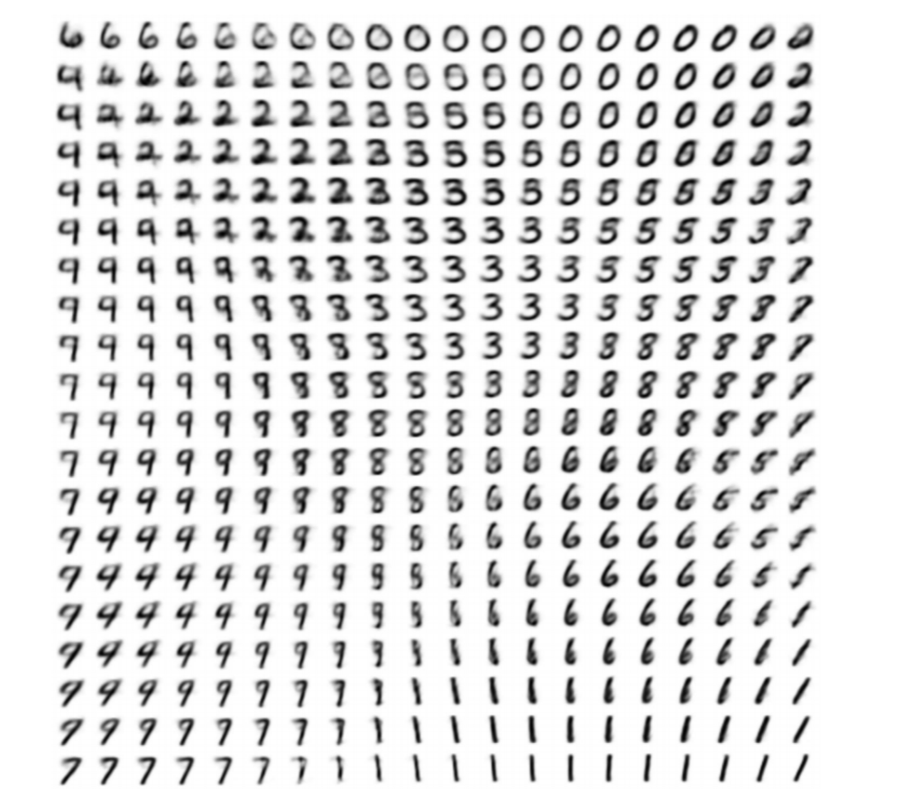
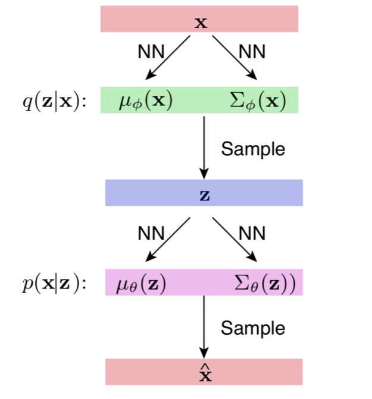
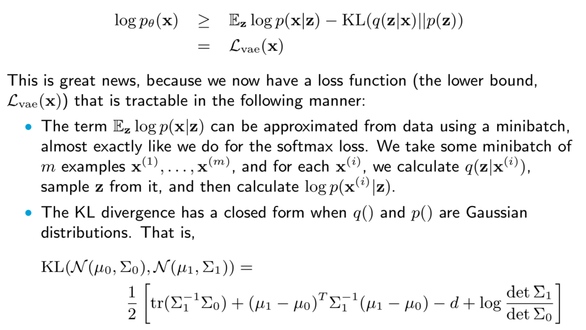

# Variational Autoencoders
- **Variational autoencoders (VAE)** are another type of generative model
    - Both a VAE and a GAN attempt to model a distribution $p(x)$, but the VAE is different in that it tries to more directly learn the distribution (the GAN  learns the distribution implicitly)
    - The VAE draws samples from $p(x)$ by first generating noise z ~ p(z) and then sampling x ~ p(x|z) - what this does is split the problem of modeling p(x) into the problem of modeling p(z) (typically chosen to be unit Gaussian noise) and p(x|z)
    - The VAE learns p(z|x) (encoder that maps images to the latent space) and p(x|z) (decoder that maps latent space to images)
    - The VAE essentially performs a dimensionality reduction, where the input image x is mapped into a latent representation $z$ that is of lower dimension
    - VAE's optimize an *evidence lower bound* rather than a likelihood (because it is difficult to express likelihoods for VAEs)
- The latent space can be interpretable:
    - 
    - An input image is passed through the encoder, where it is now $z \in R^d$, where $d$ is the dimension of the latent space and $z$ is drawn from a unit Gaussian
    - Passing the latent representation through the decoder results in a reconstruction of the image, based on the values of the latent space variable $z$ (e.g. the bottom middle graph when passed into the decoder yields an image of a "1")
## Autoencoders
- A simple autoencoder works by first perofrming a dimensionality reduction on the data (**encoder**): $x \rightarrow h$ where $x \in R^n, h \in R^d, d < n$ and then a reconstruction (**decoder**): $h \rightarrow \hat{x}$, where $\hat{x} \in R^n$
    - The intuition here is squeezing out all of the important information from the data into the latent variable (going to a lower dimension manifold)
    - As long as the information in the input can truly be contained in smaller dimensions, this approach should work 
    - Both the encoder and decoder are implemented via neural networks (so they can be trained via a loss function that ensures that the original input is similar to the reconstructed input $L = ||\hat{x} - x||$)
- $\hat{x} = g(f(x))$, where $g$ is the decoder and $f$ is the encoder
- Principal Component Analysis can be viewed as an autoencoder:
    - $L = ||x - WW^Tx||^2$
    - Note this is a *linear* autoencoder - often, it is important to learn *nonlinear* encoding/decodings for more complex scenarios
- Nonlinear dimensionality reduction can be performed by having the decoders and encoders be *neural networks*, which incorporate nonlinear transformations
    - e.g. $f(x) = \tanh(W^Tx)$, $g(x) = \tanh(Wh)$
- Sparse autoencoders: Sparse features can be encouraged by imposing a L1 regularization penalty on the features
    - $L(x, \hat{x}) + \lambda \sum_i |h_i|$, where $h_i$ is the $ith$ element of $h = f(x)$
- Autoencoders can be made robust to noise by generating noise (from a prior distribution) and adding it to the input $x$, so $x + \epsilon \rightarrow z \rightarrow \hat{x}$ so that it can now learn to reconstruct the original input (without noise) from the noisy input
    - $L(x, g(f(x + \epsilon)))$
## Variational Autoencoder
- Instead of learning functions $f$ and $g$ like in traditional autoencoders, VAEs learn *distributions* of the features given the input and the input given the activations, so $f$ and $g$ are instead distributions (so are now probabilistic)
    - z ~ $p(z|x)$: Distribution of features given the input
    - $\hat{x}$ ~ $p(x|z)$: Distribution of the input given the features
    - It is good to learn distributions because often the data incorporated in the real world is noisy
        - Additionally, VAEs are *generative* because the feature space $z$ is from a prior distribution (unit Gaussian) from which noise can be drawn from to generate data
        - Traditional autoencoders do not constrain $z$, hence why it is difficult to generate from them
- 
    - $q(z|x)$ is a continuous probability distribution representing the encoder - it is modeled to be a Gaussian with mean and variance $\mu_{\phi}(x)$ and $\Sigma_{\phi}(x)$, both of which are neural networks that are trained
        - From $q$, $z$ is sampled
        - If the VAE is used for generation, then the encoder is skipped - rather, $z$ is sampled from a unit Gaussian and fed into the decoder
    - $p(x|z)$ is also a continuous probability distribution representing the decoder, also modeled as a Gaussian with mean and variance $\mu_{\theta}(z)$ and $\Sigma_{\theta}(z)$
        - There is a different Gaussian distribution for every single latent noise input ($z$)
- Although setting $p(z)$ to be unit Gaussian may appear to be too restrictive, the distribution $p(x|z)$ can be expressive enough (e.g. an expressive distribution) to generate complex distributions
- Loss:
    - 
- In a VAE, the expectation (with respect to z) of $log(p(x|z))$ involves sampling, but sampling cannot be backpropagated through
    - To sample $z$ ~ $q(z|x^i)$, instead $\epsilon$ ~ $N(0, I)$ is instead sampled and $z$ is calculated as $z = \mu_\phi (x^i) + \Sigma_\phi^{1/2} (x^i)\epsilon$
    - Now, sampling only occurs for $\epsilon$, which does not need to be backpropagated through - though its values do need to be stored for purpose of backpropagation
    - Think of this as pre-calculating the sampling as a "constant" so that there is no need to backpropagate any further
    - 
### Beta VAEs
- VAE's suffer from two problems:
    - Latent code is ignored, so p(x|z) looks like p(x)
        - This results in a sampled $x$ generally looking like the *average* of all image classes - typically resulting in blurry images
        - This is a result of the KL-divergence penalty being *too low*
    - Latent code is *not compressed*, so q(z|x) is very different from p(z)
        - This results in a sampled $x$ looking like nonsense
        - This is a result of the KL-divergence penalty being *too high*
- To address these issues, a norm penalty can be applied to the KL-divergence ($\beta$)
    - This parameter can be scheduled - keep it low (so it can reconstruct good images) and then gradually increase it